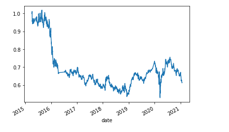
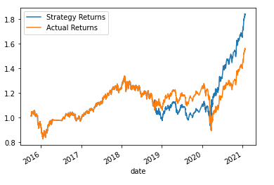
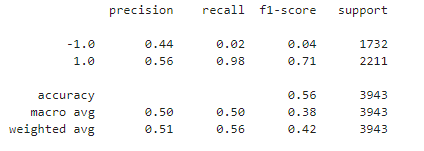
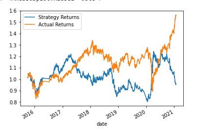
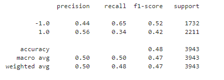

# Machine Learning Trade Bot

The goal of this project was to generate a trading strategy for emerging market equities using multiple machine learning algorithms. 

---

## Technologies

This program utilizes Python 3.7 with the following packages:

- [Pandas](https://pandas.pydata.org/) to analyze and manipulate data
- [Path](https://docs.python.org/3.7/library/pathlib.html) to load files from a file path
- [Sklearn](https://scikit-learn.org/stable/) to use the Support Vector Machine, Decision Tree and Standard Scaler learning models and features for supervised learning analysis

---

## Performance Evaluation

As a baseline, the first trading strategy did not use any machine learning algorithms and simply generated a buy signal when the prior return was positive and a sell signal when the prior return was negative. This strategy proved to provide negative results and was the worst performing strategy.

The second strategy utilized the SVC classifier model (Support Vector Machine), to determine whether two input parameters can provide accurate buy and sell signals. The two input parameters used is a 4 day and 100 day moving average, which appeared to work the best for positive performance (as opposed to using longer SMAs). As the chart demonstrates below, this strategy outperformed the Actual Returns and was very affective at identifying positive returning days as seen with the 0.98 recall. This model was also tuned initially by increasing the size of the training set from 3 months to 6 months. This change provided a positive increase in performance as the previous recall for buy days using 3 months of training data was 0.96.

As a next step, we a Decision Tree Classifier to see if the reuslts could be improved upon. After running the same data through the Decision Tree classifier, our results were not as great, indicating that this strategy would not be affective at identifying days to buy or sell. The flaw of this strategy was that while it was better at identifying sell days, it overestimated the amount of days to sell. This model performed better than the baseline but worse than the SVC model. This model also used the same SMAs and training set size as the SVC model.

As a conclusion the SVC model would be the best model to use for this strategy.

---

## License

MIT